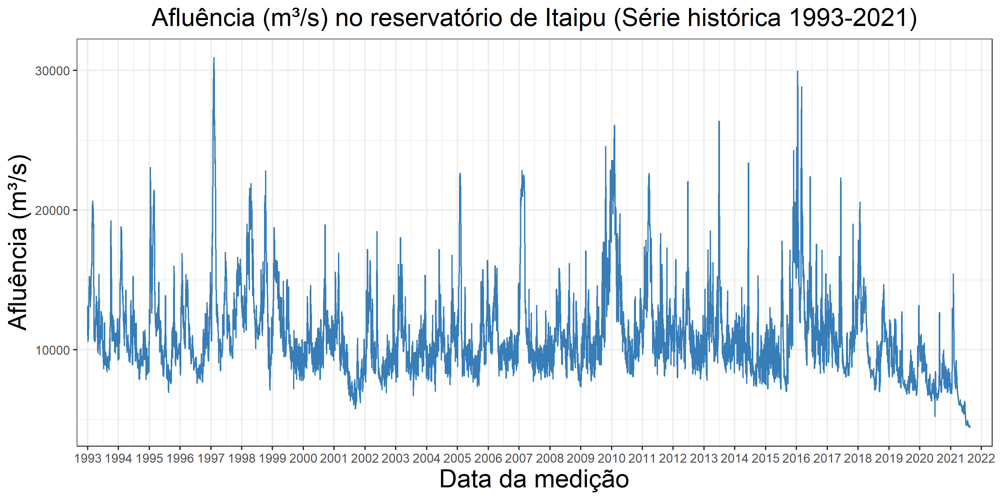

# **reservatoriosBR** 

<!-- badges: start -->

[](https://twitter.com/BrunoHMioto)

<!-- badges: end -->

Pacote R para obtenção de dados de reservatórios brasileiros a partir da plataforma [SIN-ANA](https://www.ana.gov.br/sar0/MedicaoSin).

Este pacote baixa e organiza os dados em uma estrutura para uso no R.

Se utilizar em algum trabalho, cite ou me avise! Gostaria de saber como este pacote pode ajudar!

## Instalação

Este pacote apenas está disponível para a instalação pelo github usando o devtools: 

```{r, results='hide', message=FALSE, warning=FALSE}
#install.packages("devtools")
devtools::install_github('brunomioto/reservatoriosBR')
```

## Uso

### A função `dados_reservatorio()`

Utilize a função para obter os dados históricos dos reservatórios brasileiros.

`dados_reservatorio(codigo_reservatorio, data_inicial, data_final)`

- `codigo_reservatorio` O código do reservatório de acordo com o SIN (tabela a ser implementada futuramente).
- `data_inicial` Data inicial do registro. Se for anterior à data de funcionamento, retorna a data de registro mais antiga.
- `data_final` Data final do registro. Pode ser usado `Sys.Date()` para retornar a data de registro mais recente.


```{r, message=FALSE, warning=FALSE}
library(reservatoriosBR)
dados_reservatorio(19058, "2000-01-01", "2019-12-31")
```

As variáveis retornadas são:

- `data_medicao` - Data da medição realizada
- `codigo_reservatorio` - Código do reservatório segundo o SIN-ANA
- `reservatorio` - Nome do reservatório
- `cota_m` - Cota, o nível do reservatório (m)
- `afluencia_m3_s` - Afluência (m³/s)
- `defluencia_m3_s` - Defluência (m³/s)
- `vazao_vertida_m3_s` - Vazão vertida (m³/s)
- `vazao_turbinada_m3_s` - Vazão turbinada (m³/s)
- `vazao_natural_m3_s` - Vazão natural (m³/s)
- `volume_util_percent` - Volume útil (%) - Alguns reservatórios retornam apenas NA
- `vazao_incremental_m3_s` - Vazão incremental (m³/s) - Retorna apenas NA

As unidades de medida foram mantidas no nome das variáveis para não haver problemas de interpretação.


Podemos utilizar estes dados históricos para fazer análises e gráficos. A Afluência(m³/s), por exemplo, mede a quantidade de água que chega nas represas.

```{r, warning = FALSE, message = FALSE, results = 'hide', fig.keep = 'all', dpi = 600, echo=FALSE, eval = FALSE}
library(ggplot2)

itaipu <- dados_reservatorio(19058, "1980-01-01", Sys.Date())

ggplot(itaipu, aes(x=data_medicao, y=afluencia_m3_s))+
  geom_line(color = "#377eb8")+
  scale_x_date(date_breaks = "years", date_labels = "%Y")+
  theme_bw()+
  labs(x="Data da medição",
       y = "Afluência (m³/s)")+
  coord_cartesian(xlim = c(as.Date("1994-01-01"), as.Date("2021-01-01")))
```



### A função `dados_reservatorio_cantareira()`

Utilize a função para obter os dados históricos dos reservatórios brasileiros do **sistema Cantareira**.

`dados_reservatorio_cantareira(codigo_reservatorio, data_inicial, data_final)`

- `codigo_reservatorio` O código do reservatório de acordo com o SIN (são apenas 4 reservatórios).

```{r, echo=FALSE}
Reservatorio <- c("Jaguari-Jacareí", "Cachoeira", "Atibainha", "Paiva Castro")
Codigo <- c(29001, 29002, 29003, 29004)

tabela_cantareira <- data.frame(Reservatorio, Codigo)

knitr::kable(tabela_cantareira)
```

- `data_inicial` Data inicial do registro. Se for anterior à data de funcionamento, retorna a data de registro mais antiga.
- `data_final` Data final do registro. Pode ser usado `Sys.Date()` para retornar a data de registro mais recente.

As variáveis retornadas são:

- `data_medicao` - Data da medição realizada
- `codigo_reservatorio` - Código do reservatório segundo o SIN-ANA
- `reservatorio` - Nome do reservatório
- `cota_m` - Cota, o nível do reservatório (m)
- `volume_util_hm3` - Volume útil (hm³)
- `volume_util_percent` - Volume útil (%)
- `afluencia_m3_s` - Afluência (m³/s)
- `defluencia_m3_s` - Defluência (m³/s)

## To-do

- Buscar outras bases de dados de reservatórios brasileiros

- Confirmar a confiabilidade dos dados extraídos
