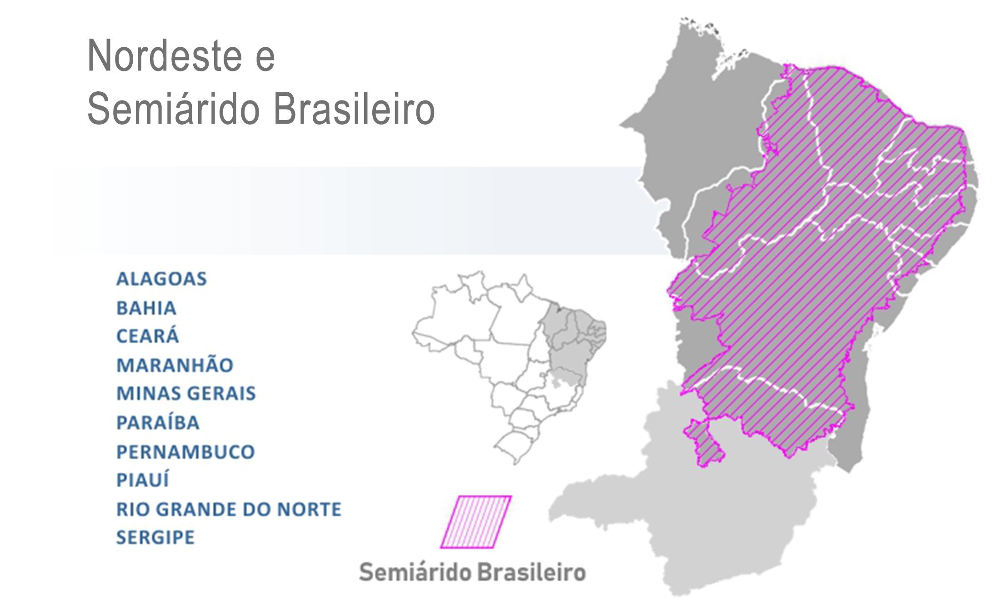

# **reservatoriosBR** 

<!-- badges: start -->

[](https://twitter.com/BrunoHMioto)

<!-- badges: end -->

Pacote R para obtenção de dados dos principais reservatórios brasileiros
a partir da plataforma [SAR-ANA](https://www.ana.gov.br/sar/).

Este pacote baixa e organiza os dados em uma estrutura para uso no R.

Atualmente estou buscando **voluntários** para testar as funções e
dados. Se puder, entre em contato\!

Se utilizar em algum trabalho, cite ou me avise\! Gostaria de saber como
este pacote pode ajudar\!

## Instalação

Este pacote apenas está disponível para a instalação pelo github usando
o devtools:

``` r
#install.packages("devtools")
devtools::install_github('brunomioto/reservatoriosBR')
```

## Uso

Atualmente o pacote possui 3 funções:

  - `reservatorio_sin()`
  - `reservatorio_cantareira()`
  - `reservatorio_nordeste_semiarido()`
  - `ultima_medicao()`

### A função `reservatorio_sin()`

Utilize a função para obter os dados históricos dos principais
reservatórios brasileiros que pertencem ao [SIN - Sistema Interligado
Nacional](https://www.ana.gov.br/sar/sin). A imagem abaixo apresenta as
bacias dos reservatórios contidos no SIN.


`reservatorio_sin(codigo_reservatorio, data_inicial, data_final)`

  - `codigo_reservatorio` O código do reservatório de acordo com o SIN
    (você pode consultar a tabela com os códigos chamando
    `tabela_reservatorios`).
  - `data_inicial` Data inicial do registro. Se for anterior à data de
    funcionamento, retorna a data de registro mais antiga.
  - `data_final` Data final do registro. Pode ser usado `Sys.Date()`
    para retornar a data de registro mais recente.

<!-- end list -->

``` r
library(reservatoriosBR)
reservatorio_sin(19058, "2000-01-01", "2019-12-31")
```

    ## # A tibble: 7,306 x 11
    ##    data_medicao codigo_reservat~ reservatorio cota_m afluencia_m3_s
    ##    <date>       <fct>            <fct>         <dbl>          <dbl>
    ##  1 2000-01-01   19058            ITAIPU         216.           9761
    ##  2 2000-01-02   19058            ITAIPU         216.           9300
    ##  3 2000-01-03   19058            ITAIPU         216.           9385
    ##  4 2000-01-04   19058            ITAIPU         216.           9450
    ##  5 2000-01-05   19058            ITAIPU         216.           8868
    ##  6 2000-01-06   19058            ITAIPU         216.           8275
    ##  7 2000-01-07   19058            ITAIPU         215.           7963
    ##  8 2000-01-08   19058            ITAIPU         215.           8367
    ##  9 2000-01-09   19058            ITAIPU         215.           9408
    ## 10 2000-01-10   19058            ITAIPU         215.           8706
    ## # ... with 7,296 more rows, and 6 more variables: defluencia_m3_s <dbl>,
    ## #   vazao_vertida_m3_s <dbl>, vazao_turbinada_m3_s <dbl>,
    ## #   vazao_natural_m3_s <dbl>, volume_util_percent <dbl>,
    ## #   vazao_incremental_m3_s <dbl>

As variáveis retornadas são:

  - `data_medicao` - Data da medição realizada
  - `codigo_reservatorio` - Código do reservatório segundo o SAR-ANA
  - `reservatorio` - Nome do reservatório
  - `cota_m` - Cota, o nível do reservatório (m)
  - `afluencia_m3_s` - Afluência (m³/s)
  - `defluencia_m3_s` - Defluência (m³/s)
  - `vazao_vertida_m3_s` - Vazão vertida (m³/s)
  - `vazao_turbinada_m3_s` - Vazão turbinada (m³/s)
  - `vazao_natural_m3_s` - Vazão natural (m³/s)
  - `volume_util_percent` - Volume útil (%) - Alguns reservatórios
    retornam apenas NA
  - `vazao_incremental_m3_s` - Vazão incremental (m³/s) - Retorna apenas
    NA

As unidades de medida foram mantidas no nome das variáveis para não
haver problemas de interpretação.

Podemos utilizar estes dados históricos para fazer análises e gráficos.
A Afluência(m³/s), por exemplo, mede a quantidade de água que chega nas
represas.


### A função `reservatorio_cantareira()`

Utilize a função para obter os dados históricos dos reservatórios
brasileiros que pertencem ao [**sistema
Cantareira**](https://www.ana.gov.br/sar/outros-sistemas-hidricos/cantareira).
A imagem abaixo apresenta as bacias dos reservatórios contidos no
Sistema Cantareira.


`reservatorio_cantareira(codigo_reservatorio, data_inicial, data_final)`

  - `codigo_reservatorio` O código do reservatório de acordo com o SAR
    (são apenas 4 reservatórios).

| Reservatorio    | Codigo |
| :-------------- | -----: |
| Jaguari-Jacareí |  29001 |
| Cachoeira       |  29002 |
| Atibainha       |  29003 |
| Paiva Castro    |  29004 |

  - `data_inicial` Data inicial do registro. Se for anterior à data de
    funcionamento, retorna a data de registro mais antiga.
  - `data_final` Data final do registro. Pode ser usado `Sys.Date()`
    para retornar a data de registro mais recente.

As variáveis retornadas são:

  - `data_medicao` - Data da medição realizada
  - `codigo_reservatorio` - Código do reservatório segundo o SAR-ANA
  - `reservatorio` - Nome do reservatório
  - `cota_m` - Cota, o nível do reservatório (m)
  - `volume_util_hm3` - Volume útil (hm³)
  - `volume_util_percent` - Volume útil (%)
  - `afluencia_m3_s` - Afluência (m³/s)
  - `defluencia_m3_s` - Defluência (m³/s)

### A função `reservatorio_nordeste_semiarido()` (implementando)

Utilize a função para obter os dados históricos dos reservatórios
brasileiros que pertencem ao módulo [**Nordeste e
Semiárido**](https://www.ana.gov.br/sar/nordeste-e-semiarido) do SAR. A
imagem abaixo apresenta os estados dos reservatórios contidos no SAR.



### A função `ultima_medicao()`

Essa função retorna a última medição (e somente ela) dos dados de um
reservatório.

Fiz essa função pois ela fornece o **Volume útil** de alguns
reservatórios que não estão inclusos no dataset criado pela função
`dados_reservatorio()`, como é o exemplo de **Itaipu**.

`ultima_medicao(codigo_reservatorio)`

As variáveis retornadas são:

  - `data_medicao` - Data da medição realizada
  - `reservatorio` - Nome do reservatório
  - `afluencia_m3_s` - Afluência (m³/s)
  - `defluencia_m3_s` - Defluência (m³/s)
  - `cota_m` - Cota, o nível do reservatório (m)
  - `vazao_transferida` - Vazão transferida - Acho que sempre retorna
    `NA`
  - `volume_util_percent` - Volume útil (%)
  - `tipo` - Tipo? Ainda preciso descobrir o que isso significa

## O dataset `tabela_reservatorios`

Esse dataset já vem pré-carregado com o pacote\! Nele estão algumas
informações sobre os reservatórios que podem ser carregados com as
funções acima.

São 708 reservatórios com 5 variáveis, sendo elas: - `sistema` - Sistema
o qual o reservatório pertence. - `estado_1` - Estado o qual o
reservatório pertence. - `estado_2` - Se o reservatório fica entre dois
estados, o segundo estado. A ordem não tem importância. - `reservatorio`
- O nome do reservatório. - `codigo` - O código do reservatório segundo
o SAR. Utilizado nas funções desse pacote.

``` r
head(tabela_reservatorios)
```

    ##      sistema estado_1 estado_2    reservatorio codigo
    ## 1 cantareira       SP     <NA> JAGUARI-JACAREI  29001
    ## 2 cantareira       SP     <NA>       CACHOEIRA  29002
    ## 3 cantareira       SP     <NA>       ATIBAINHA  29003
    ## 4 cantareira       SP     <NA>    PAIVA CASTRO  29004
    ## 5        sin       RS     <NA>     14 DE JULHO  19083
    ## 6        sin       MG       SP     A. VERMELHA  19015

## To-do

  - Buscar outras bases de dados de reservatórios brasileiros

  - Confirmar a confiabilidade dos dados extraídos
